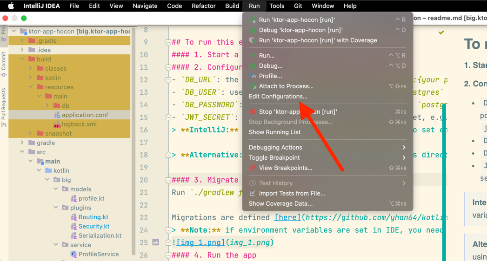
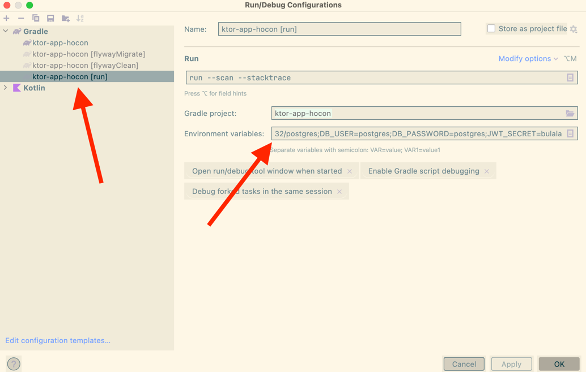
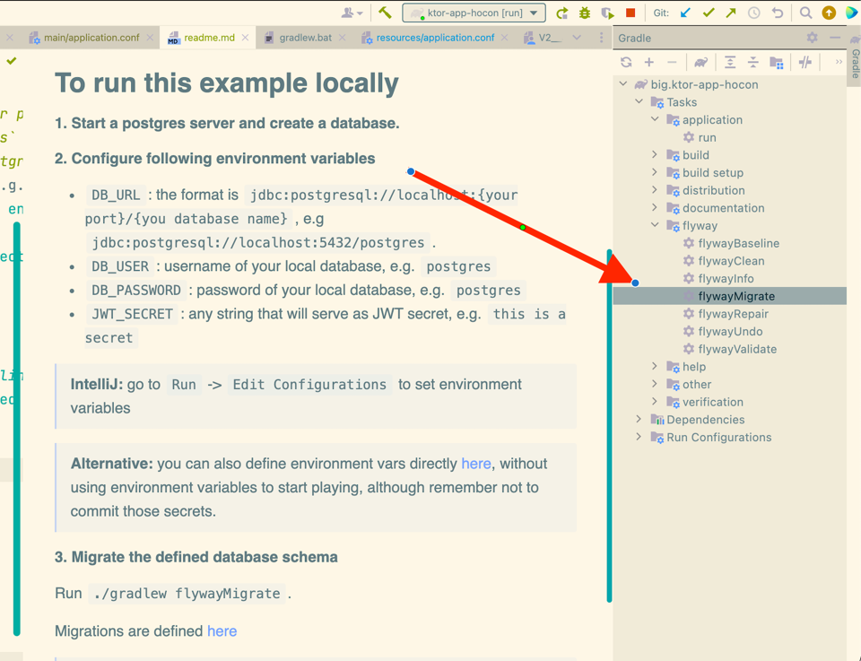
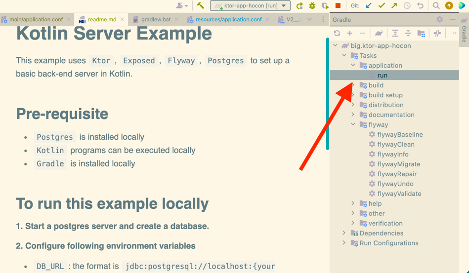
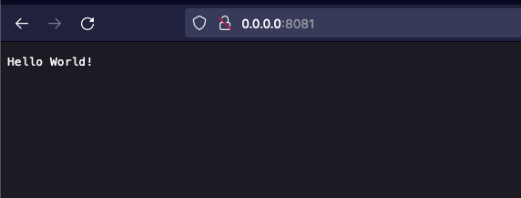
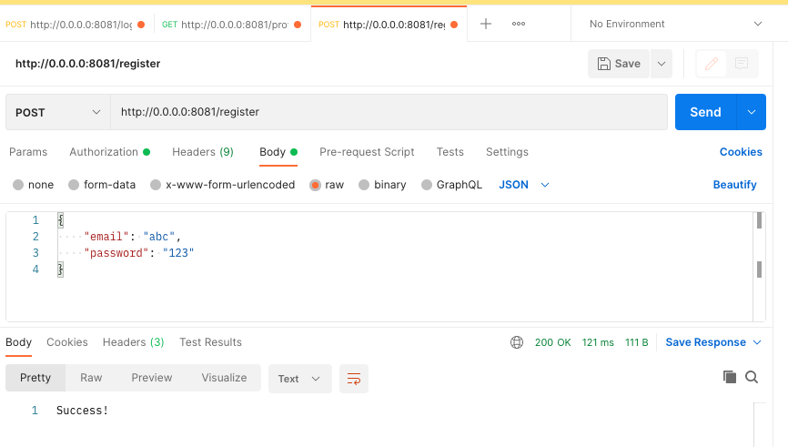
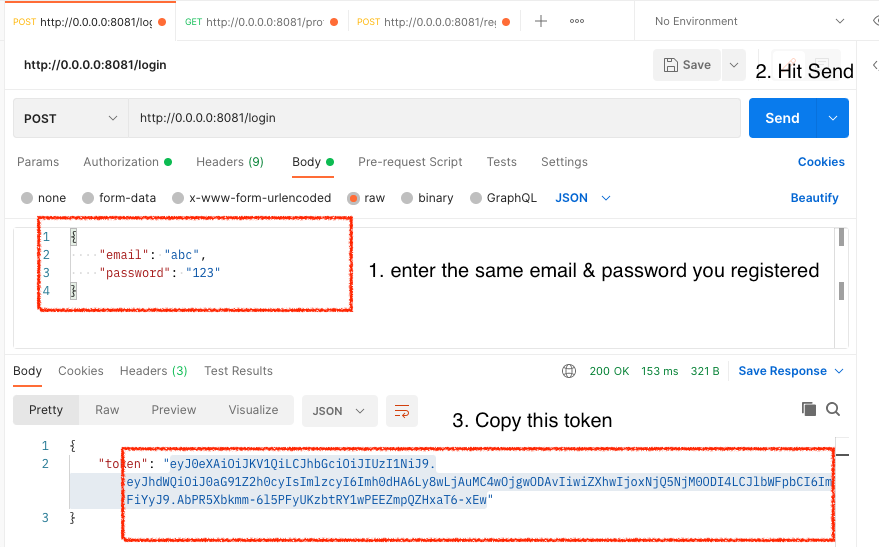
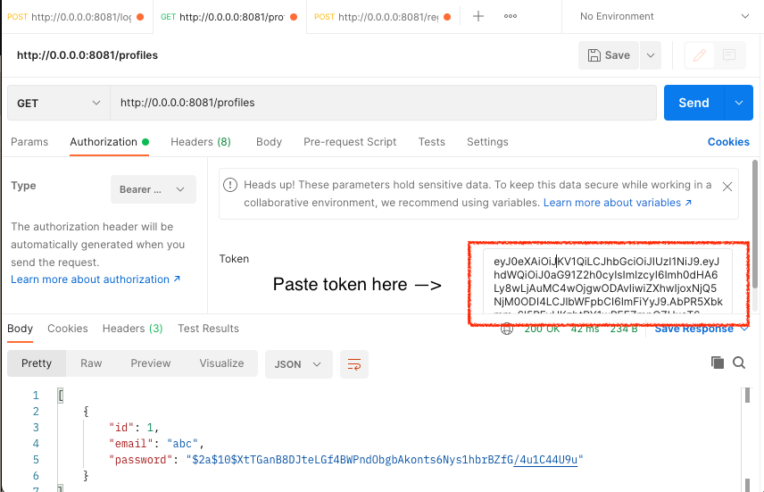

# Kotlin Server Example
This example uses `Ktor`, `Exposed`, `Flyway`, `Postgres` to set up a basic back-end server in Kotlin.

## Pre-requisite
- `Postgres` is installed locally
- `Kotlin` programs can be executed locally
- `Gradle` is installed locally 

## To run this example locally
#### 1. Start a postgres server and create a database.
#### 2. Configure following environment variables 
- `DB_URL`: the format is `jdbc:postgresql://localhost:{your port}/{you database name}`, e.g `jdbc:postgresql://localhost:5432/postgres`. 
- `DB_USER`: username of your local database, e.g. `postgres`
- `DB_PASSWORD`: password of your local database, e.g. `postgres`
- `JWT_SECRET`: any string that will serve as JWT secret, e.g. `this is a secret`
> **IntelliJ:** 
> Go to `Run` -> `Edit Configurations` to set environment variables
> 
> Configure environment variables for each Gradle task, **not just the one highlighted** in the screenshot.
> 

> **Alternative:** you can also define environment vars directly [here](https://github.com/yhan64/kotlin-server-example/blob/main/src/main/resources/application.conf), without using environment variables to start playing, although remember not to commit those secrets.

#### 3. Migrate database schema 
Run `./gradlew flywayMigrate` if environments are passed in terminal or set directly in `application.conf`

Migrations are defined [here](https://github.com/yhan64/kotlin-server-example/tree/main/src/main/resources/db/migration)
> **Note:** if environment variables are set in IDE, you need to run the gradle task from IDE to get them correctly

#### 4. Run the app
Run `./gradlew run` if environments are passed in terminal or set directly in `application.conf`.

> **IntelliJ:**
> 

#### 5. Test the app
**Hello World**

Enter `0.0.0.0:8081` in browser, you will see

**Create a profile**
1. Send a POST request to `0.0.0.0:8081/register`

2. Login via `0.0.0.0:8081/login` and copy the token returned

3. Use this token to access authenticated route, e.g. `0.0.0.0:8081/profiles` to get all profiles.

